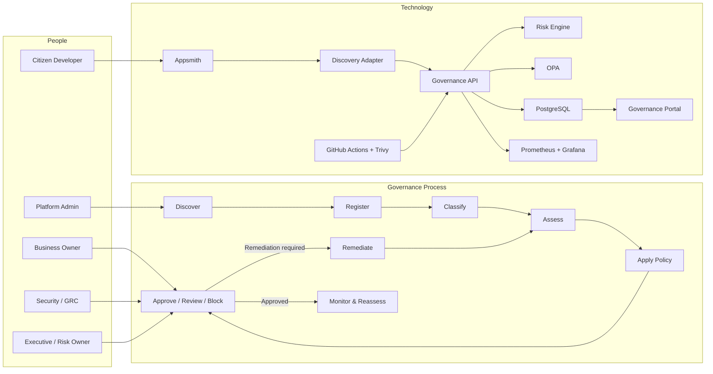

# Executive Architecture — People, Process, Technology

```mermaid
flowchart LR
    subgraph PEOPLE["People"]
        CD["Citizen Developer"]
        BO["Business Owner"]
        SG["Security / GRC"]
        PA["Platform Admin"]
        ER["Executive / Risk Owner"]
    end

    subgraph PROCESS["Governance Process"]
        D["Discover"]
        R["Register"]
        C["Classify"]
        A["Assess"]
        P["Apply Policy"]
        G["Approve / Review / Block"]
        M["Remediate"]
        MON["Monitor & Reassess"]

        D --> R --> C --> A --> P --> G
        G -->|Approved| MON
        G -->|Remediation required| M --> A
    end

    subgraph TECHNOLOGY["Technology"]
        AS["Appsmith"]
        DISC["Discovery Adapter"]
        API["Governance API"]
        RISK["Risk Engine"]
        OPA["OPA"]
        DB["PostgreSQL"]
        PORTAL["Governance Portal"]
        OBS["Prometheus + Grafana"]
        CICD["GitHub Actions + Trivy"]
    end

    CD --> AS
    BO --> G
    SG --> G
    PA --> D
    ER --> G

    AS --> DISC --> API
    API --> RISK
    API --> OPA
    API --> DB
    DB --> PORTAL
    API --> OBS
    CICD --> API
```
