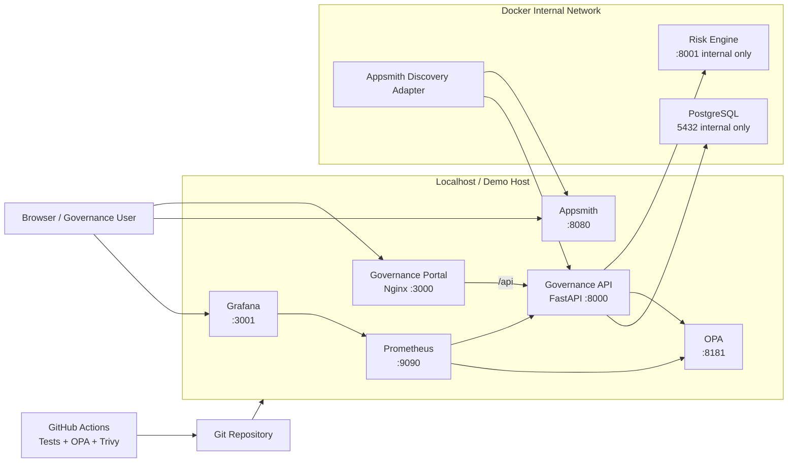

# Technical Component Architecture

```mermaid
flowchart LR
    USER["Browser / Governance User"]

    subgraph HOST["Localhost / Demo Host"]
        PORTAL["Governance Portal<br/>Nginx :3000"]
        API["Governance API<br/>FastAPI :8000"]
        APPSMITH["Appsmith<br/>:8080"]
        GRAFANA["Grafana<br/>:3001"]
        PROM["Prometheus<br/>:9090"]
        OPA["OPA<br/>:8181"]
    end

    subgraph INTERNAL["Docker Internal Network"]
        DISC["Appsmith Discovery Adapter"]
        RISK["Risk Engine<br/>:8001 internal only"]
        DB["PostgreSQL<br/>5432 internal only"]
    end

    USER --> PORTAL
    USER --> APPSMITH
    USER --> GRAFANA

    PORTAL -->|/api| API

    DISC --> APPSMITH
    DISC --> API

    API --> RISK
    API --> OPA
    API --> DB

    PROM --> API
    PROM --> OPA
    GRAFANA --> PROM

    CI["GitHub Actions<br/>Tests + OPA + Trivy"]
    REPO["Git Repository"]

    CI --> REPO
    REPO --> HOST
```
