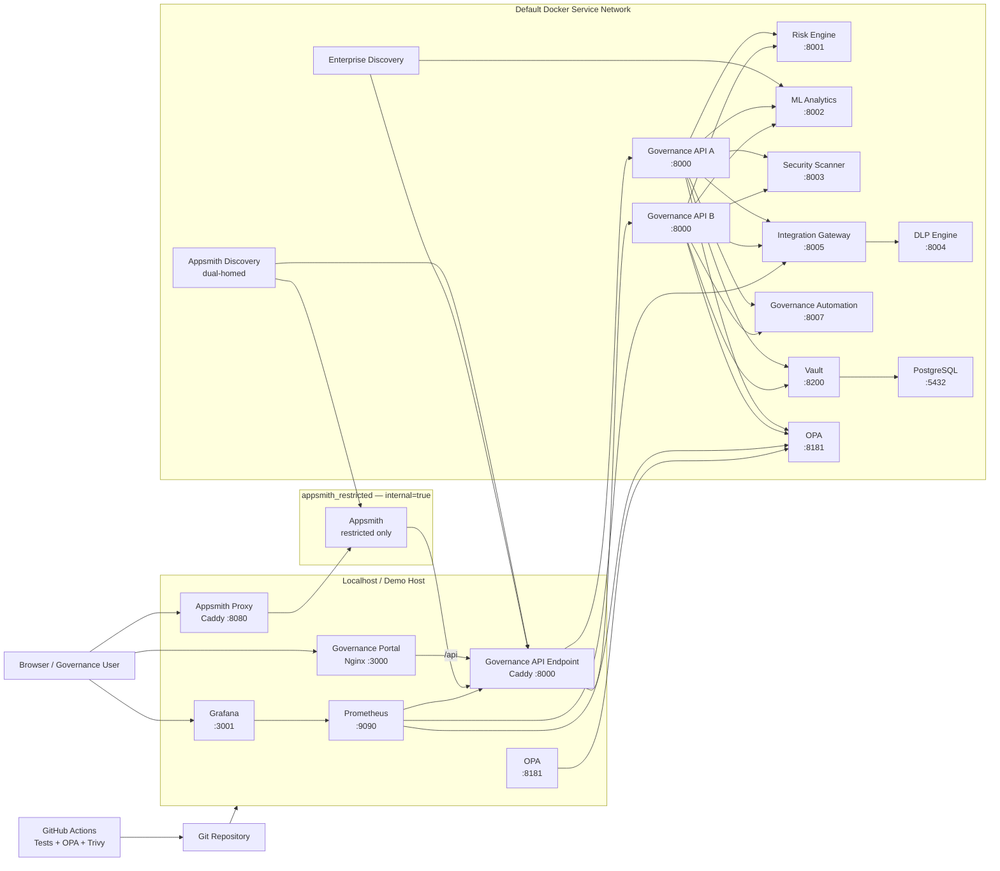

# Technical Component Architecture

```mermaid

flowchart LR

    USER["Browser / Governance User"]

    subgraph HOST["Localhost / Demo Host"]
        PORTAL["Governance Portal<br/>Nginx :3000"]
        APPEDGE["Appsmith Proxy<br/>Caddy :8080"]
        APIEDGE["Governance API Endpoint<br/>Caddy :8000"]
        GRAFANA["Grafana<br/>:3001"]
        PROM["Prometheus<br/>:9090"]
        OPAHOST["OPA<br/>:8181"]
    end

    subgraph RESTRICTED["appsmith_restricted — internal=true"]
        APPSMITH["Appsmith<br/>restricted only"]
    end

    subgraph SERVICES["Default Docker Service Network"]
        DISC["Appsmith Discovery<br/>dual-homed"]
        EDISC["Enterprise Discovery"]

        APIA["Governance API A<br/>:8000"]
        APIB["Governance API B<br/>:8000"]

        RISK["Risk Engine<br/>:8001"]
        ML["ML Analytics<br/>:8002"]
        SCAN["Security Scanner<br/>:8003"]
        DLP["DLP Engine<br/>:8004"]
        GW["Integration Gateway<br/>:8005"]
        AUTO["Governance Automation<br/>:8007"]

        DB["PostgreSQL<br/>:5432"]
        VAULT["Vault<br/>:8200"]
        OPA["OPA<br/>:8181"]
    end

    USER --> PORTAL
    USER --> APPEDGE
    USER --> GRAFANA

    APPEDGE --> APPSMITH

    PORTAL -->|"/api"| APIEDGE

    APIEDGE --> APIA
    APIEDGE --> APIB

    DISC --> APPSMITH
    DISC --> APIEDGE

    EDISC --> APIEDGE
    EDISC --> ML

    APPSMITH --> APIEDGE

    APIA --> RISK
    APIB --> RISK

    APIA --> ML
    APIB --> ML

    APIA --> SCAN
    APIB --> SCAN

    APIA --> OPA
    APIB --> OPA

    APIA --> GW
    APIB --> GW

    APIA --> AUTO
    APIB --> AUTO

    APIA --> VAULT
    APIB --> VAULT

    VAULT --> DB
    GW --> DLP

    PROM --> APIEDGE
    PROM --> OPA
    PROM --> GW

    GRAFANA --> PROM
    OPAHOST --> OPA

    CI["GitHub Actions<br/>Tests + OPA + Trivy"]
    REPO["Git Repository"]

    CI --> REPO
    REPO --> HOST

```
