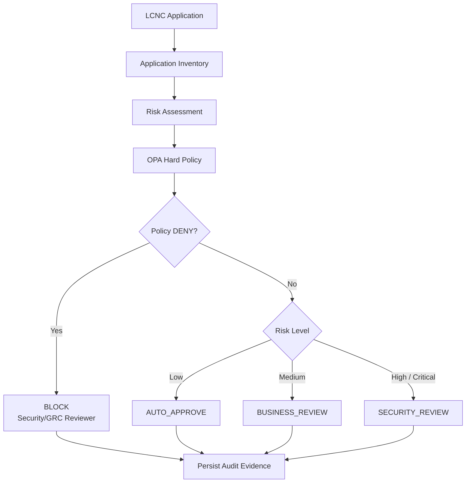

# Governance Decision Flow

```mermaid
flowchart TD
    APP["LCNC Application"]
    INV["Application Inventory"]
    RISK["Risk Assessment"]
    POLICY["OPA Hard Policy"]
    DENY{"Policy DENY?"}
    LEVEL{"Risk Level"}
    BLOCK["BLOCK<br/>Security/GRC Reviewer"]
    LOW["AUTO_APPROVE"]
    MED["BUSINESS_REVIEW"]
    HIGH["SECURITY_REVIEW"]
    AUDIT["Persist Audit Evidence"]

    APP --> INV
    INV --> RISK
    RISK --> POLICY
    POLICY --> DENY

    DENY -->|Yes| BLOCK
    DENY -->|No| LEVEL

    LEVEL -->|Low| LOW
    LEVEL -->|Medium| MED
    LEVEL -->|High / Critical| HIGH

    BLOCK --> AUDIT
    LOW --> AUDIT
    MED --> AUDIT
    HIGH --> AUDIT
```

## Design Rule

Risk scoring informs governance. OPA enforces mandatory policy independently of the numerical score.
