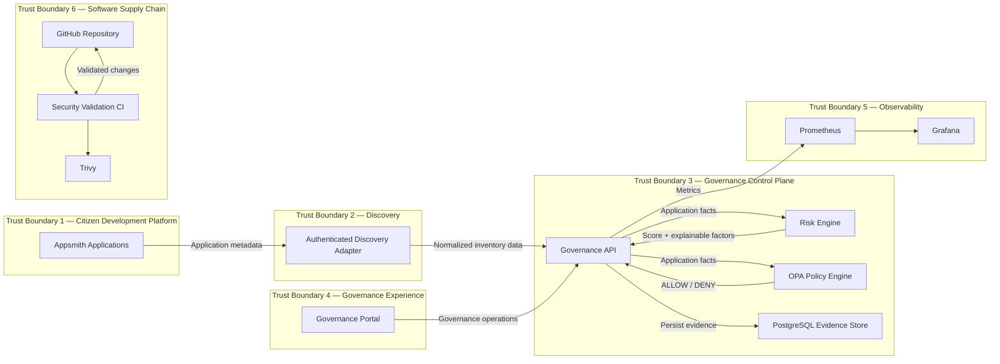

# Security Trust Boundaries

## Fail-Closed Behavior

### Risk Engine failure

Risk Engine unavailable → 503 Service Unavailable → no policy decision → no governance authorization.

### OPA failure

OPA unavailable → 503 Service Unavailable → no governance authorization.

## Security Principle

Mandatory governance dependencies fail closed. The system does not manufacture an approval when a required decision component is unavailable.
