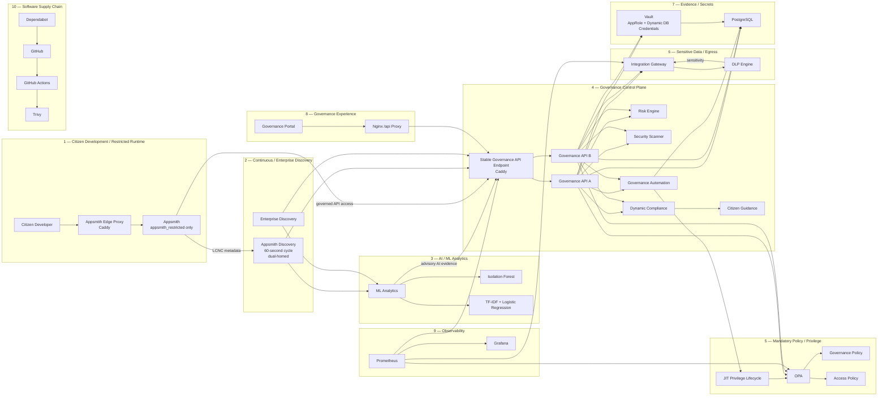

# Security Trust Boundaries — MVP V5

```mermaid

flowchart LR

    subgraph TB1["1 — Citizen Development / Restricted Runtime"]
        DEV["Citizen Developer"]
        APPPROXY["Appsmith Edge Proxy<br/>Caddy"]
        APP["Appsmith<br/>appsmith_restricted only"]

        DEV --> APPPROXY
        APPPROXY --> APP
    end

    subgraph TB2["2 — Continuous / Enterprise Discovery"]
        DISC["Appsmith Discovery<br/>60-second cycle<br/>dual-homed"]
        EDISC["Enterprise Discovery"]
    end

    subgraph TB3["3 — AI / ML Analytics"]
        ML["ML Analytics"]
        ANOM["Isolation Forest"]
        CLASS["TF-IDF + Logistic Regression"]

        ML --> ANOM
        ML --> CLASS
    end

    subgraph TB4["4 — Governance Control Plane"]
        APIEDGE["Stable Governance API Endpoint<br/>Caddy"]
        APIA["Governance API A"]
        APIB["Governance API B"]
        RISK["Risk Engine"]
        SCAN["Security Scanner"]
        COMP["Dynamic Compliance"]
        GUIDE["Citizen Guidance"]
        AUTO["Governance Automation"]

        APIEDGE --> APIA
        APIEDGE --> APIB
    end

    subgraph TB5["5 — Mandatory Policy / Privilege"]
        OPA["OPA"]
        GOV["Governance Policy"]
        ACCESS["Access Policy"]
        JIT["JIT Privilege Lifecycle"]

        OPA --> GOV
        OPA --> ACCESS
        JIT --> OPA
    end

    subgraph TB6["6 — Sensitive Data / Egress"]
        GW["Integration Gateway"]
        DLP["DLP Engine"]

        GW --> DLP
    end

    subgraph TB7["7 — Evidence / Secrets"]
        DB["PostgreSQL"]
        VAULT["Vault<br/>AppRole + Dynamic DB Credentials"]

        VAULT --> DB
    end

    subgraph TB8["8 — Governance Experience"]
        PORTAL["Governance Portal"]
        NGINX["Nginx /api Proxy"]

        PORTAL --> NGINX
    end

    subgraph TB9["9 — Observability"]
        PROM["Prometheus"]
        GRAF["Grafana"]

        PROM --> GRAF
    end

    subgraph TB10["10 — Software Supply Chain"]
        GIT["GitHub"]
        CI["GitHub Actions"]
        TRIVY["Trivy"]
        DEP["Dependabot"]

        GIT --> CI
        CI --> TRIVY
        DEP --> GIT
    end

    APP -->|"LCNC metadata"| DISC
    APP -->|"governed API access"| APIEDGE

    DISC --> APIEDGE
    DISC --> ML

    EDISC --> APIEDGE
    EDISC --> ML

    ML -->|"advisory AI evidence"| APIEDGE

    APIA --> RISK
    APIB --> RISK

    APIA --> SCAN
    APIB --> SCAN

    APIA --> OPA
    APIB --> OPA

    APIA --> AUTO
    APIB --> AUTO

    AUTO --> JIT

    APIA --> GW
    APIB --> GW

    DLP -->|"sensitivity"| GW

    APIA --> COMP
    APIB --> COMP

    COMP --> GUIDE

    APIA --> VAULT
    APIB --> VAULT

    APIA --> DB
    APIB --> DB
    AUTO --> DB

    NGINX --> APIEDGE

    PROM --> APIEDGE
    PROM --> GW
    PROM --> OPA

```
