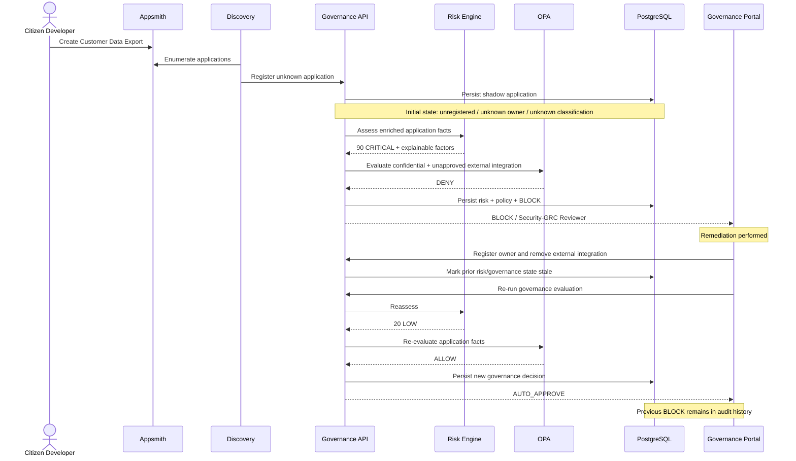

# Live Demo Sequence

## Demo Story

1. Discover an unmanaged LCNC application.
2. Enrich its security context.
3. Explain why risk becomes CRITICAL.
4. Show OPA independently enforcing DENY.
5. Show governance returning BLOCK and assigning Security/GRC review.
6. Remediate the application.
7. Reassess to LOW risk.
8. Show OPA ALLOW and AUTO_APPROVE.
9. Prove that the original BLOCK remains in the audit history.
