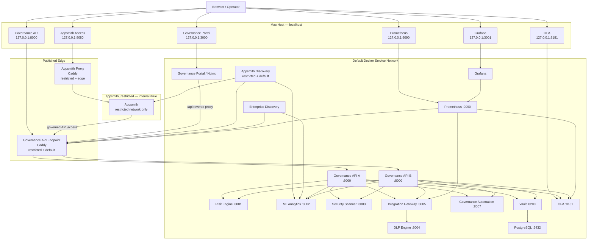

# LCNC Security Governance — Network Architecture

## Purpose

This diagram shows which services are exposed to the Mac host and which remain internal to the Docker Compose network.

The MVP intentionally exposes only services required for the demo and administration.

Appsmith itself remains only on the internal `appsmith_restricted` network. Localhost access on `127.0.0.1:8080` is provided by the dual-homed `appsmith-proxy`, which joins `appsmith_restricted` and `appsmith_edge`.

The stable Governance API endpoint on `127.0.0.1:8000` is a Caddy reverse proxy/load balancer. It joins `appsmith_restricted` and the default service network and routes traffic to two stateless Governance API replicas on the default network.

