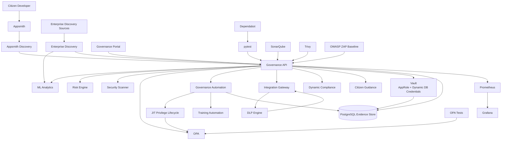

# LCNC Security Governance — MVP V3 Security Architecture

## Purpose

This artifact shows where security controls are placed across the MVP and which component owns each security decision.

The architecture intentionally separates:

- discovery
- AI-assisted analysis
- deterministic risk evaluation
- mandatory policy enforcement
- approval automation
- time-limited privileged access
- sensitive-data inspection
- secrets management
- audit evidence
- human accountability
- software security validation

## Security Control Architecture

## Decision Ownership

| Control | Primary Owner |
|---|---|
| Shadow IT / enterprise discovery | Discovery services |
| AI anomaly detection | ML Analytics |
| AI classification suggestion | ML Analytics |
| Deterministic application risk | Risk Engine |
| Deterministic security findings | Security Scanner |
| Mandatory governance policy | OPA |
| Fine-grained authorization | OPA |
| Approval routing and escalation | Governance Automation |
| Human approval accountability | Business / Security / GRC stakeholder |
| Temporary privileged access | Governance Automation + OPA |
| Sensitive-data detection | DLP Engine |
| Outbound-transfer enforcement | Integration Gateway |
| Dynamic compliance | Governance API |
| Training requirement automation | Governance API / Governance Automation |
| Dynamic database credentials | Vault |
| Durable evidence | PostgreSQL |
| Static code/security analysis | SonarQube |
| Vulnerability/secret/misconfiguration scanning | Trivy |
| Baseline runtime DAST | OWASP ZAP workflow |
| Dependency lifecycle | Dependabot |

## Trust and Enforcement Principles

AI evidence is advisory.

OPA remains the mandatory policy authority.

Human reviewers remain accountable for organizational decisions but cannot override a hard mandatory BLOCK through the approval automation path.

JIT grants are scoped and time-limited and remain subject to OPA guardrails.

DLP and the Integration Gateway fail closed for protected outbound-transfer evaluation.

Vault reduces long-lived database-secret exposure by issuing dynamic credentials to the Governance API.

Internal services remain on the Docker service network unless direct host/operator access is required.

## MVP Boundary

The local MVP demonstrates the control architecture.

Production deployment would add:

- enterprise identity and MFA
- workload identities
- TLS/mTLS
- production-hardened Vault
- network segmentation
- high availability
- backup and disaster recovery
- SIEM integration
- tamper-evident audit storage
- production source connectors
- production model monitoring
