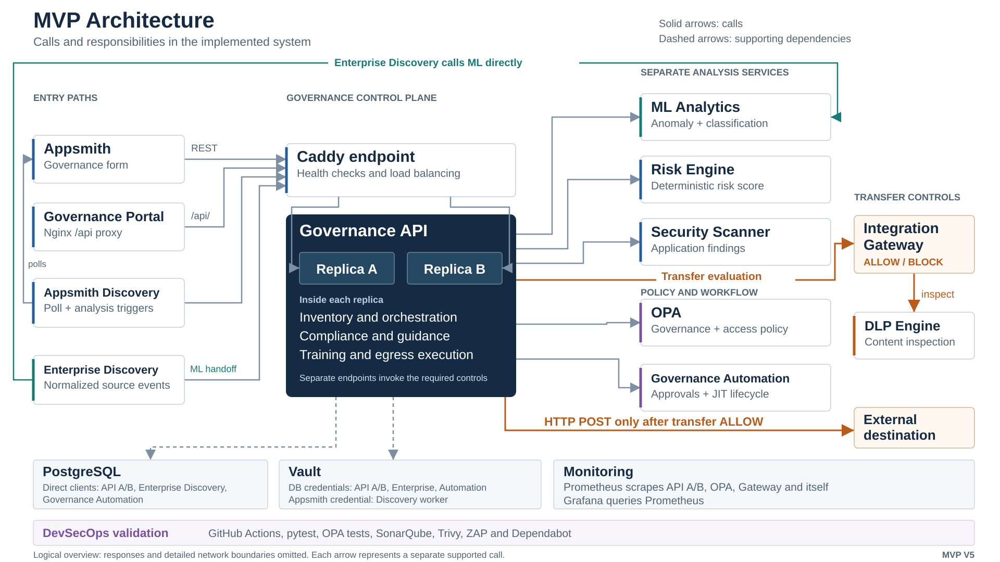

# LCNC Security Governance — MVP V5 System Architecture

## Purpose

The platform provides an external AI-assisted security and governance control plane for enterprise low-code/no-code environments.

Appsmith remains the connected reference LCNC platform. The current MVP also includes an Enterprise Discovery service that accepts normalized discovery events from multiple source adapters, persists source evidence, and hands sufficiently complete telemetry to ML analysis.

The control plane discovers and inventories citizen-developed applications, analyzes risk, applies security controls, enforces policy, automates accountable approval workflows, manages time-limited privileged access, records evidence, and provides governance and developer guidance.

## Core Design Principles

- Unknown telemetry is not treated as safe.
- AI assists detection and classification but does not independently authorize applications.
- OPA makes mandatory policy and access-control decisions.
- DLP inspects sensitive data before external transfers.
- Historical evidence is retained after reassessment.
- Application metadata PATCH requests mark current derived assessments and governance state stale; observed-workflow changes separately invalidate scanner state.
- Automation supports human accountability rather than replacing it.
- Hard policy blocks cannot be silently overridden by human approval.
- Privileged access is time-limited and auditable through JIT grants.
- Governance API database credentials are issued dynamically through Vault.
- Internal services remain internal unless host access is required.
- Security controls have distinct responsibilities rather than stacking overlapping tools.

## High-Level Architecture

The [editable SVG overview](diagrams/mvp-system-overview.svg) is the figure to reuse on **Slide 6 — MVP Architecture**. Slide 5 explains the governance operating model and decision responsibilities; Slide 6 shows the components that implement them.

This is a logical view of the implemented MVP. Solid arrows show calls, not a single pipeline that every request traverses. Responses are omitted. Dashed arrows show API infrastructure dependencies; the supporting boxes list the other database and Vault clients. Detailed host ports, network boundaries and operational sequences belong in supporting views.

### Entry paths and the API boundary

- Appsmith REST actions call the stable `governance-api` endpoint. Browser access to Appsmith itself uses the separate `appsmith-proxy`.
- The Governance Portal uses its Nginx `/api/` proxy to reach that same stable endpoint.
- Appsmith Discovery polls Appsmith and invokes inventory, workflow-evidence, ML and scanner endpoints on the Governance API. It does not call ML Analytics directly or automatically run governance evaluation.
- Enterprise Discovery calls ML Analytics directly when anomaly telemetry is complete, then hands the existing result to `/enterprise-discovery/handoff`. It separately persists its discovery records in PostgreSQL.

The Compose service named `governance-api` is **Caddy**. It health-checks and load-balances across the Python services `governance-api-a` and `governance-api-b`. Either replica can make the downstream calls drawn from the API boundary. Inventory, orchestration, dynamic compliance, citizen guidance, training and controlled-egress execution are modules inside those replicas, not additional services.

### Separate control paths

| Path | Calls and responsibility |
|---|---|
| Analysis | API calls ML Analytics for anomaly/classification and Security Scanner for findings through separate endpoints. ML suggestions remain advisory. |
| Governance evaluation | API calls Risk Engine, evaluates OPA governance policy, reads stored anomaly state, persists the outcome, requests approval routing and assigns required training. OPA deny takes precedence; an assessed positive anomaly requires security review before ordinary risk-level routing. |
| Approval and training | Governance Automation creates approval records and manages escalation/human decisions. Even `AUTO_APPROVE` routes to human confirmation. API modules assign training; Automation checks outstanding required assignments directly in PostgreSQL. |
| Access and JIT | API obtains active grant context from Automation and passes it to OPA access policy. Automation owns grant requests, approval, expiry and revocation. There is no direct JIT-to-OPA call. |
| Transfer evaluation | API validates the destination, derives destination trust, loads authoritative classification and calls Integration Gateway. Gateway calls DLP and returns its transfer verdict. |
| Controlled egress | On transfer `ALLOW`, the API executes the external HTTP POST. On `BLOCK`, it makes no outbound request. The evaluation-only endpoint does not execute a transfer. |

The governance endpoint does not rerun every analysis service. OPA authorization and controlled egress are explicit paths, not universal API middleware. A persisted governance decision can coexist with a reported approval-routing or training-assignment error; inspect those returned statuses separately.

### Supporting systems

- API A/B, Enterprise Discovery and Governance Automation connect directly to PostgreSQL with their workload-specific Vault credentials. Vault manages credentials rather than forwarding their SQL.
- Appsmith Discovery retrieves its managed Appsmith credential from Vault KV.
- Prometheus scrapes API A and B directly, plus OPA, Integration Gateway and itself. Grafana queries Prometheus.
- GitHub Actions, pytest, OPA tests, SonarQube, Trivy, the ZAP workflow and Dependabot provide software validation outside the synchronous business-request flow.

The export's direct Appsmith `GetApprovals` query targets Automation on the default network, while Appsmith is attached only to `appsmith_restricted`. That query requires separate runtime verification and is not drawn as a working connection. The verified approval route in this overview is API to Automation.

Implementation references: [Compose](../docker-compose.yml), [Caddy](../governance-api/caddy/Caddyfile), [Portal proxy](../governance-portal/nginx.conf), [Appsmith actions](../appsmith/exports/lcnc-governance-demo-v4.json), [Appsmith Discovery](../discovery/appsmith_discovery.py), [Enterprise Discovery](../enterprise-discovery/app/main.py), [governance workflow](../governance-api/app/workflow.py), [authorization](../governance-api/app/access.py), [controlled egress](../governance-api/app/integration.py), [Automation](../governance-automation/app/main.py), [Prometheus](../monitoring/prometheus.yml).

## 1. Citizen Development Layer

Reference platform:

- Appsmith

Responsibilities:

- hosts citizen-developed applications
- exposes application metadata
- provides the source inventory for discovery

Appsmith does not make governance decisions.

## 2. Continuous and Enterprise Discovery Layer

Components:

- `discovery`
- `enterprise-discovery`

### Appsmith Discovery

The Appsmith discovery worker:

- authenticates to the connected Appsmith platform
- enumerates applications every 60 seconds
- compares discovered applications with the governance inventory
- identifies previously unknown applications
- refreshes last-seen evidence
- triggers downstream analysis when required metadata exists

### Enterprise Discovery

The Enterprise Discovery service:

- accepts normalized discovery events from source adapters
- records source type and external source identifier
- persists discovery evidence in `enterprise_discoveries`
- supports generic enterprise security-feed ingestion
- exposes a source registry for additional enterprise connectors
- invokes ML analysis automatically when telemetry is feature-complete

Appsmith is the connected reference implementation.

The generic enterprise feed demonstrates the multi-source ingestion contract.

A Microsoft Defender Cloud Apps adapter is represented as an extension point but is not configured as a live production connector.

Missing telemetry remains pending rather than being treated as safe.

Examples:

- `ML-PENDING`
- `CLASSIFICATION-PENDING`
- `SCAN-PENDING`

## 3. AI / ML Analytics Layer

Component:

- `ml-analytics`

### Shadow IT Anomaly Detection

Model:

- Isolation Forest
- `isolation-forest-v1`

Example features:

- owner known
- business purpose known
- internet exposure
- external integration count
- unapproved integration count
- API-key usage
- connector count
- external domain count
- recent change activity

Outputs:

- anomaly decision
- anomaly score
- context signals
- append-only historical assessment evidence

### AI-Assisted Classification

Model:

- TF-IDF
- Logistic Regression
- `classification-v1`

Classes:

- public
- internal
- confidential
- restricted

Inputs include:

- application name
- business purpose
- data fields
- connector metadata

Outputs include:

- suggested classification
- confidence
- review-required state

AI classification is advisory. The stored governance classification remains authoritative.

## 4. Governance Control Plane

Primary component:

- `governance-api`

Automation component:

- `governance-automation`

Governance API responsibilities:

- application inventory
- metadata enrichment
- enterprise discovery integration
- ML orchestration
- security-scan orchestration
- risk assessment
- governance evaluation
- access authorization
- outbound-transfer evaluation and controlled-egress execution
- dynamic compliance
- audit history
- citizen-developer guidance
- training automation

Governance Automation responsibilities:

- create persistent approval requests
- route cases to the required accountable role
- enforce approval SLA deadlines
- escalate overdue approval requests
- persist human approval decisions and reasons
- prevent human approval from overriding a mandatory BLOCK
- enforce required-training gates
- manage JIT privilege requests
- issue time-limited privilege grants after accountable approval
- expire or revoke privilege grants
- persist approval and privilege lifecycle events

Governance evaluation automatically hands actionable workflow outcomes from the Governance API to Governance Automation.

## 5. Risk Engine

Component:

- `risk-engine`

Provides:

- deterministic risk scoring
- explainable factors
- risk levels
- model/version evidence

Risk scores are advisory inputs and cannot override mandatory policy.

## 6. Citizen Application Security Scanner

Component:

- `security-scanner`

Checks include:

- unregistered application
- missing owner
- unknown classification
- unapproved external integration
- API-key usage
- insecure HTTP integration
- possible embedded secret
- sensitive data with external connectivity

Outputs include:

- findings
- severity
- pass/fail state
- historical scan evidence

## 7. Policy-as-Code, Access Control, and JIT Privilege

Component:

- OPA

Policy domains:

- `lcnc.governance`
- `lcnc.access`

OPA evaluates underlying facts rather than relying only on numerical risk.

Access policy considers:

- user role
- requested action
- application registration
- data sensitivity
- valid JIT privilege context

Permanent role permissions and temporary JIT grants remain subject to mandatory policy guardrails.

JIT access does not bypass:

- application registration requirements
- restricted-data protections
- mandatory governance policy

JIT lifecycle:

Request
→ accountable Security/GRC decision
→ time-limited grant
→ OPA-aware authorization
→ automatic expiry or explicit revocation

Access and privilege lifecycle decisions are persisted for audit.

## 8. DLP and Outbound Transfer Enforcement

Components:

- `dlp-engine` — content inspection
- `integration-gateway` — transfer-policy evaluation
- `governance-api` replicas — destination validation, evaluation persistence and allowed outbound execution

DLP detects indicators including:

- email
- phone
- payment card
- SSN
- confidential field names
- restricted field names

Raw sensitive transfer content is not persisted in `integration_transfer_events`. The API stores evaluation metadata before execution and returns the external response status to the caller.

The Integration Gateway combines:

- authoritative classification
- DLP-detected sensitivity
- destination trust
- transport security

Examples of blocked transfers:

- unknown classification to an external destination
- unapproved external destination
- external HTTP destination
- restricted data leaving the approved boundary

## 9. Dynamic Compliance

Seven live controls are evaluated:

- CTRL-01 Owner assigned
- CTRL-02 Classification established
- CTRL-03 External integrations approved
- CTRL-04 Security scanning acceptable
- CTRL-05 Sensitive egress protected by DLP
- CTRL-06 Access decisions enforced through OPA
- CTRL-07 Governance decision current

Statuses:

- pass
- fail
- not assessed

Compliance snapshots can be stored as historical evidence.

Framework references are alignment themes, not certification claims.

## 10. Citizen Developer Enablement

Capabilities:

- evidence-based security score
- Gold / Silver / Bronze / Needs Attention badge
- targeted secure-development guidance
- recommended training
- automatic training assignment
- control-to-training mapping
- due dates for required training
- training completion tracking
- approval gating when required training remains incomplete
- achievement status
- durable training lifecycle events

Training requirements are triggered by actual failed or not-assessed controls.

Training readiness can affect approval workflow progression, but completion of training does not override a mandatory OPA BLOCK.

## 11. Evidence Layer

Primary durable component:

- PostgreSQL

Stored evidence includes:

- applications
- discovery state
- enterprise discovery records
- risk assessments
- anomaly assessments
- classification assessments
- security scans and findings
- policy decisions
- governance decisions
- approval requests
- approval events
- OPA access decisions
- JIT privilege requests
- JIT privilege grants
- JIT privilege events
- integration transfer events
- compliance assessments
- training completions
- training assignments
- training events

Additional runtime evidence exists in:

- Vault for dynamic credential issuance
- Prometheus for operational metrics
- Grafana for visualization
- SonarQube for static-analysis and Quality Gate evidence
- Git/GitHub for source and CI traceability

## 12. Governance Portal

Component:

- `governance-portal`

Provides visibility into:

- application inventory
- ownership and registration
- risk
- AI anomaly evidence
- AI classification
- security scanning
- DLP / transfer decisions
- OPA access decisions
- dynamic compliance
- security score and badge
- targeted citizen-developer guidance
- historical governance evidence

The browser accesses the Governance API through the Nginx `/api/` reverse proxy.

## 13. Observability

Components:

- Prometheus
- Grafana

Provides visibility into:

- service health
- governance activity
- risk activity
- policy outcomes
- workflow behavior
- operational metrics

## 14. DevSecOps

The project intentionally uses distinct controls rather than overlapping scanners.

Validation responsibilities:

- pytest — application and security regression testing
- OPA tests — governance and access-policy validation
- SonarQube — static source analysis, maintainability, security findings, and Quality Gate
- Trivy — vulnerability, secret, and misconfiguration scanning
- OWASP ZAP — baseline runtime DAST workflow
- Dependabot — dependency and container update lifecycle
- Docker Compose validation — deployment configuration validation

SonarQube replaces CodeQL as the project's source-code static-analysis platform.

The local SonarQube instance is available at `localhost:9000`.

The ZAP GitHub workflow is configured, but execution evidence should only be claimed when the workflow has actually run.

Runtime credentials are kept outside Git.

`.env` is excluded from Git.

Governance API database access does not use a long-lived application database password. It authenticates to Vault using AppRole and requests dynamic PostgreSQL credentials.

## Decision Authority Model

| Component | Responsibility |
|---|---|
| ML Analytics | Detect and classify |
| Risk Engine | Quantify and explain risk |
| Security Scanner | Detect deterministic findings |
| DLP | Inspect sensitive data |
| Integration Gateway | Evaluate outbound-transfer policy using DLP evidence |
| Governance API | Orchestrate explicit control paths and execute allowed outbound requests |
| OPA | Mandatory governance and access decisions |
| Governance API workflow | Select and persist the governance outcome |
| Governance Automation | Approval routing, human decisions, escalation and JIT lifecycle |
| Human Stakeholders | Final organizational accountability |

## Failure Behavior

### ML unavailable

AI analysis remains unavailable or pending. A safe result is not fabricated.

### Scanner unavailable

The application is not treated as having passed security scanning.

### Risk Engine unavailable

Governance evaluation fails instead of inventing a risk result.

### OPA unavailable

Mandatory authorization fails closed.

### DLP unavailable

Outbound-transfer evaluation fails closed and blocks the transfer.

### Missing telemetry

Missing values remain unknown or pending rather than being converted to safe defaults.

## Local MVP Deployment

Host-accessible services:

- Governance Portal — `localhost:3000`
- Grafana — `localhost:3001`
- Governance API — `localhost:8000` through the stable Caddy endpoint; two internal stateless API replicas provide local control-plane failover
- ML Analytics — `localhost:8002`
- DLP Engine — `localhost:8004`
- Enterprise Discovery — `localhost:8006`
- Governance Automation — `localhost:8007`
- Appsmith — `localhost:8080` through `appsmith-proxy`; Appsmith itself remains only on the internal `appsmith_restricted` network
- OPA — `localhost:8181`
- Vault — `localhost:8200`
- SonarQube — `localhost:9000`
- Prometheus — `localhost:9090`

Internal-only services:

- Governance API A/B replicas — `8000`, behind the stable Caddy endpoint
- Risk Engine — `8001`
- Security Scanner — `8003`
- Integration Gateway — `8005`
- PostgreSQL — `5432`
- Appsmith discovery worker — background service

Docker Compose provides the local service networks.

Appsmith itself is attached only to `appsmith_restricted`, which is configured as an internal Docker network. `appsmith-proxy` is dual-homed on `appsmith_restricted` and `appsmith_edge`, providing localhost access without attaching Appsmith itself to the edge network.

The stable `governance-api` service is a Caddy endpoint attached to `appsmith_restricted` and the default service network. It health-checks and load-balances across `governance-api-a` and `governance-api-b`.

Internal-only services are intentionally not exposed to the host when direct browser/operator access is unnecessary.

## Production Boundary

The current implementation is a localhost-focused interview/capstone MVP.

Production hardening would additionally require:

- enterprise SSO and MFA
- stronger API authentication
- workload/service identities
- TLS or mTLS between services
- production-hardened Vault deployment
- persistent Vault storage and HA
- operational Vault unseal/recovery procedures
- migration of remaining local demo secrets into managed secret paths
- network segmentation
- database hardening and encryption
- tamper-evident audit storage
- broader control-plane and stateful-service high availability beyond the demonstrated Governance API A/B failover
- backup and disaster recovery
- SIEM integration
- additional production LCNC/security connectors
- distributed rate limiting
- signed artifacts and software provenance
- production model monitoring and validation

These are future production requirements and are not claimed as current MVP capabilities.
